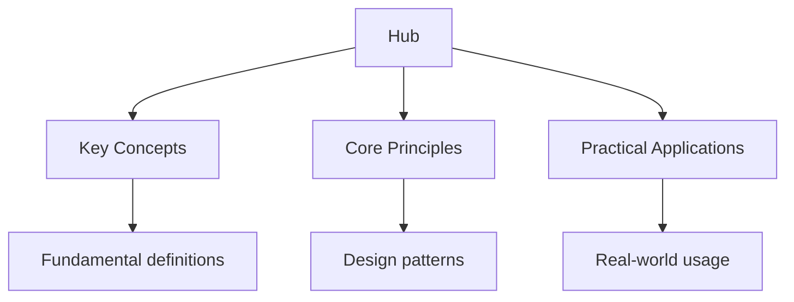

<script type="application/ld+json">
{
  "@context": "https://schema.org",
  "@type": "BreadcrumbList",
  "itemListElement": [
    {"name": "Home", "url": "https://tuning.wyattau.com"},
    {"name": "Hub", "url": "https://tuning.wyattau.com/hub"}
  ]
}
</script>

<script type="application/ld+json">
{
  "@context": "https://schema.org",
  "@type": "Course",
  "name": "Performance Tuning and Optimization Guide",
  "description": "Comprehensive performance tuning guide covering CPU, memory, GPU, storage, cooling, stress testing, and BIOS configuration for maximising system performance.",
  "provider": {
    "@type": "Organization",
    "name": "Wyatt's Notes",
    "url": "https://tuning.wyattau.com"
  },
  "url": "https://tuning.wyattau.com/hub",
  "educationalLevel": "Professional",
  "inLanguage": "en",
  "isAccessibleForFree": true
}
</script>




## Why This Guide Exists

Performance tuning is the art and science of extracting maximum capability from your hardware. Whether you are a gamer pushing frame rates higher, a content creator rendering video faster, or an engineer optimising a workstation for scientific computing, the principles are the same: understand your hardware, adjust its parameters, and verify the results with benchmarks.

This hub page maps every resource on this site. The guides cover every subsystem of a modern computer — CPU, memory, GPU, storage, cooling, and power supply — with practical, tested techniques for each. Every recommendation includes the reasoning behind it, so you understand not just what to do but why it works. The goal is not to push hardware to destruction, but to find the optimal balance of performance, stability, and longevity.

## Table of Contents

- [Tuning Philosophy](#tuning-philosophy)
- [CPU Tuning](#cpu-tuning)
- [Memory Tuning](#memory-tuning)
- [GPU Tuning](#gpu-tuning)
- [Storage Tuning](#storage-tuning)
- [Cooling Systems](#cooling-systems)
- [Stress Testing](#stress-testing)
- [BIOS Configuration](#bios-configuration)
- [Power Supply Considerations](#power-supply-considerations)
- [Undervolting and Overclocking](#undervolting-and-overclocking)
- [Cross-Site Resources](#cross-site-resources)
- [FAQ](#faq)

---

## Tuning Philosophy

Before touching any settings, understand these principles:

### 1. Measure First

Never change a setting without a baseline measurement. Run benchmarks before and after every change. If you cannot measure the improvement, you cannot confirm the improvement.

### 2. Change One Thing at a Time

Change a single variable, benchmark, and record the result. Changing multiple settings simultaneously makes it impossible to identify what helped and what hurt.

### 3. Stability Over Speed

A system that crashes is useless, regardless of how fast it runs. Always validate stability after every change with stress tests. A 5% performance gain is not worth a system that crashes during critical work.

### 4. Diminishing Returns Exist

The first 10% of performance gains are usually easy. The last 5% may require doubling power consumption and heat output. Know when to stop.

### 5. Thermal Limits Are Real

Every component has a thermal design power (TDP) and a maximum operating temperature. Exceeding these reduces lifespan and can cause permanent damage. Tune within thermal limits.

---

## CPU Tuning

The CPU is the brain of your system. Tuning it involves adjusting clock speeds, voltages, power limits, and memory configurations.

### Clock Speed and Voltage

Modern CPUs use dynamic frequency scaling — they automatically boost to higher clocks when thermal and power headroom allows. You can influence this behaviour through several mechanisms:

- **Base clock (BCLK)** — the fundamental clock frequency; typically 100 MHz
- **Multiplier** — BCLK × multiplier = core clock speed
- **Voltage (Vcore)** — higher voltage allows higher clocks but increases heat and power
- **Load-Line Calibration (LLC)** — compensates for voltage droop under load

### Intel CPU Tuning

Intel CPUs use Thermal Velocity Boost (TVB), Turbo Boost Max 3.0, and traditional turbo boost. Tuning options include:

- **Intel XTU** — software-based tuning utility
- **BIOS settings** — multiplier, voltage, power limits (PL1, PL2, Tau)
- **Undervolting** — reducing voltage at stock clocks for lower temperatures

### AMD CPU Tuning

AMD Ryzen processors use Precision Boost Overdrive (PBO) and Curve Optimiser:

- **PBO** — allows the CPU to boost beyond official limits when thermal and power conditions allow
- **Curve Optimiser** — per-core voltage-frequency curve adjustment for better all-core performance
- **PPT, TDC, EDC** — power delivery limits that control boost behaviour

### Power Limits

Intel CPUs have two power limits:

- **PL1** (long-term) — sustained power draw
- **PL2** (short-term) — peak power draw for a limited duration (Tau)

Increasing PL1 and PL2 allows sustained higher performance but requires better cooling.

---

## Memory Tuning

Memory (RAM) performance significantly impacts overall system speed, particularly for bandwidth-sensitive workloads.

### XMP / EXPO Profiles

The simplest memory optimisation is enabling XMP (Intel) or EXPO (AMD) profiles in BIOS. These set the memory to its rated speed and timings rather than the default JEDEC speed.

- **DDR4** — XMP profiles typically set 3200–3600 MHz with tightened timings
- **DDR5** — XMP profiles set 5600–7200+ MHz with optimised timings

### Memory Timings

Key timing parameters:

| Timing | Description | Impact |
| -------- | ------------- | -------- |
| CAS Latency (CL) | Cycles to access a column | Lower is better |
| tRCD | Row-to-column delay | Lower is better |
| tRP | Row precharge time | Lower is better |
| tRAS | Row active time | Lower is better |
| tRC | Row cycle time | Lower is better |

### Memory Frequency vs. Timings

For AMD Ryzen, the "sweet spot" is typically DDR4-3600 with CL16 or DDR5-6000 with CL30. For Intel, higher frequency is generally better due to the ring bus architecture.

### Memory Overclocking

Memory overclocking involves:

1. Enable XMP/EXPO as a starting point
2. Increase frequency in small increments (100 MHz for DDR4, 200 MHz for DDR5)
3. Test stability with MemTest86 or TestMem5
4. If unstable, loosen timings or increase voltage slightly
5. Repeat until you reach the limit of your memory kit

---

## GPU Tuning

The GPU is the primary performance component for gaming, 3D rendering, and GPU-accelerated computing.

### NVIDIA GPU Tuning

- **MSI Afterburner** — the universal GPU tuning tool
- **NVIDIA Inspector** — advanced NVIDIA-specific tuning
- **EVGA Precision X1** — EVGA-specific tool (limited availability)

**Key adjustments:**

- **Core clock offset** — increase in 15–25 MHz increments
- **Memory clock offset** — increase in 50–100 MHz increments
- **Power limit** — increase to maximum for more headroom
- **Fan curve** — customise fan speed vs. temperature relationship
- **Voltage** — increase cautiously; most GPUs have voltage locks

### AMD GPU Tuning

- **AMD Software: Adrenalin** — AMD's official tuning tool
- **MorePowerTool** — for unlocking additional power limits

**Key adjustments:**

- **GPU frequency** — set maximum and minimum clocks
- **VRAM frequency** — overclock memory for bandwidth
- **Power limit** — increase for sustained boost clocks
- **Undervolting** — reduce voltage at stock clocks for lower temperatures

### GPU Optimisation Tips

- Always increase power limit first — this gives the GPU more headroom
- Test with GPU-intensive benchmarks (FurMark, 3DMark, Unigine)
- Monitor temperatures — keep below 85°C for sustained loads
- Use a custom fan curve for better thermal management
- Undervolting often provides better performance per watt than overclocking

---

## Storage Tuning

Storage performance affects boot times, application loading, and file transfer speeds.

### SSD Optimisation

- **Enable TRIM** — maintains SSD performance over time
- **AHCI mode** — ensure your SSD operates in AHCI mode, not IDE
- **Firmware updates** — keep SSD firmware current
- **Over-provisioning** — reserve 10–20% of SSD capacity for wear levelling

### HDD Optimisation

- **AAM (Automatic Acoustic Management)** — trade noise for performance
- **APM (Advanced Power Management)** — balance power saving and performance
- **Stripe size** — match to workload (64 KB for general use, 256 KB for large files)

### File System Tuning

- **NTFS** — default Windows file system; enable large file records for better performance
- **ext4** — Linux default; tune journal mode and block size
- **ZFS** — use appropriate record size and compression settings
- **XFS** — high-performance Linux file system for large files

### RAID and Storage Arrays

- **RAID 0** — maximum performance, no redundancy
- **RAID 1** — mirroring for redundancy
- **RAID 5/6** — parity-based with capacity efficiency
- **RAID 10** — mirror + stripe for performance and redundancy
- **NVMe RAID** — motherboard RAID for NVMe drives

---

## Cooling Systems

Cooling is the bottleneck for sustained performance. Better cooling allows higher clocks and more stable operation.

### Air Cooling

- **Tower coolers** — Noctua NH-D15, be quiet! Dark Rock Pro 4
- **Case fans** — positive pressure configuration (more intake than exhaust)
- **Fan curves** — configure in BIOS or software for optimal noise-to-performance ratio
- **Thermal paste** — apply a thin, even layer; replace every 2–3 years

### Liquid Cooling

- **AIO (All-in-One) coolers** — sealed, maintenance-free; 240 mm, 280 mm, or 360 mm radiators
- **Custom loops** — maximum performance; requires maintenance and expertise
- **Radiator placement** — front-mounted for CPU, top-mounted for exhaust
- **Fan configuration** — push or pull; both work; push-pull is marginal improvement

### Thermal Management

- **Ambient temperature** — every 1°C increase in room temperature raises component temperatures
- **Case airflow** — ensure unobstructed intake and exhaust paths
- **Cable management** — tidy cables improve airflow
- **Dust filters** — clean monthly; dusty filters restrict airflow
- **Thermal pads** — use on VRMs and M.2 SSDs for heat dissipation

### Temperature Targets

| Component | Idle | Load | Maximum |
| ----------- | ------ | ------ | --------- |
| CPU | 30–40°C | 60–80°C | 90–100°C |
| GPU | 30–40°C | 65–85°C | 90–95°C |
| NVMe SSD | 30–40°C | 50–70°C | 75°C |

---

## Stress Testing

Stress testing validates system stability under maximum load. Never consider a system stable until it passes stress tests.

### CPU Stress Tests

- **Prime95** — the gold standard for CPU stability testing; use Small FFTs for maximum heat
- **AIDA64** — comprehensive system stress test
- **Cinebench** — renders a scene; useful for both testing and benchmarking
- **Intel Burn Test** — extremely demanding; validates absolute stability

**Recommended duration:**

- Quick validation: 30 minutes
- Thorough validation: 2–4 hours
- Maximum confidence: 24 hours

### GPU Stress Tests

- **FurMark** — extreme GPU stress test; generates maximum heat
- **3DMark** — realistic gaming workload simulation
- **Unigine Heaven/Superposition** — sustained GPU load with visual output
- **OCCT** — combined CPU + GPU stress test

### Memory Stress Tests

- **MemTest86** — bootable USB tool; run overnight for thorough testing
- **TestMem5 (TM5)** — Windows-based; excellent for memory overclocking
- **HCI MemTest** — running multiple instances for parallel testing

### Storage Stress Tests

- **CrystalDiskMark** — benchmark sequential and random I/O
- **ATTO Disk Benchmark** — test performance across different block sizes
- **fio** — flexible I/O tester for advanced workloads

---

## BIOS Configuration

BIOS settings directly impact system performance and stability.

### Key BIOS Settings for Performance

- **XMP/EXPO** — enable for rated memory speed
- **CPU Power Limits** — adjust PL1/PL2 (Intel) or PPT/TDC/EDC (AMD)
- **Resizable BAR** — enable for GPU performance improvement
- **PCIe Gen** — set to highest supported generation for GPU and NVMe
- **Fast Boot** — skip hardware checks for faster boot times
- **Virtualisation** — enable VT-d (Intel) or AMD-Vi for VM performance

### Settings to Avoid Changing

- **BCLK** — overclocking via base clock is unreliable on modern platforms
- **CPU voltage** — only adjust if you understand the implications
- **Memory voltage** — only adjust when overclocking memory
- **PCIe frequency** — leave at auto unless you know exactly what you are doing

---

## Power Supply Considerations

The power supply is the most underrated component in a performance system.

### Sizing Your PSU

- Add up the TDP of all components
- Add 30–50% headroom for transient power spikes
- For a system with a 300W GPU and 125W CPU, a 650–750W PSU is appropriate
- For overclocked systems, add additional headroom

### PSU Quality

- **80+ certification** — efficiency rating (Bronze, Gold, Platinum, Titanium)
- **Single rail vs. multi-rail** — single rail is simpler; multi-rail adds protection
- **Modularity** — fully modular PSUs allow cleaner cable management
- **Warranty** — quality PSUs come with 7–10 year warranties

---

## Undervolting and Overclocking

Undervolting and overclocking are complementary techniques for maximising performance per watt.

### Undervolting

Undervolting reduces the voltage supplied to a component while maintaining stability. Benefits include:

- Lower temperatures
- Reduced power consumption
- Less fan noise
- Extended component lifespan

**Undervolting a GPU:**

1. Open MSI Afterburner
2. Reduce core voltage in small increments (−5 mV)
3. Run a stress test to validate stability
4. Repeat until instability occurs
5. Back off by 10–15 mV from the instability point

### Overclocking

Overclocking increases clock speeds beyond stock specifications. Benefits include higher performance, but with increased power consumption and heat.

**Overclocking a CPU:**

1. Enable XMP/EXPO for memory
2. Increase multiplier in small increments
3. Stress test after each increment
4. If unstable, increase voltage slightly
5. Monitor temperatures — stay below 85°C for sustained loads

### The Performance Triangle

Every tuning decision involves three factors:

```
        Performance
           /\
          /  \
         /    \
        /      \
  Stability — Longevity
```

Maximising one often compromises the others. Find the balance that suits your needs.

---

## Cross-Site Resources

Performance tuning connects to many other areas:

- **[Linux Administration](https://linux.wyattau.com/hub)** — Linux-specific performance tuning and system configuration
- **[TrueNAS Administration](https://truenas.wyattau.com/hub)** — storage server performance optimisation
- **[Networking](https://networking.wyattau.com/hub)** — network performance tuning
- **[Security](https://security.wyattau.com/hub)** — security considerations that may impact performance
- **[Developer Tools](https://tools.wyattau.com/hub)** — application-level performance profiling
- **[C++ Programming](https://programming.wyattau.com/hub)** — low-level programming for performance-critical applications

---

## Frequently Asked Questions

### Is overclocking worth the risk?

Modern CPUs and GPUs have built-in protections that make overclocking relatively safe. The worst case is typically instability (crashes), not hardware damage, as long as you stay within thermal limits. The performance gains are modest (5–15% for CPU, 5–10% for GPU) but can be meaningful for demanding workloads.

### How do I know if my overclock is stable?

Run stress tests for an extended period. For CPUs, Prime95 Small FFTs for 4+ hours without errors is a good baseline. For GPUs, FurMark or 3DMark stress test for 1+ hour without artifacts or crashes. For memory, MemTest86 overnight without errors.

### Should I undervolt or overclock?

Undervolt first. It provides temperature and power savings with minimal performance loss — often negligible. If you still need more performance after undervolting, then consider overclocking. Many users find that undervolting provides the best balance of performance, thermals, and noise.

### What is the safest way to overclock?

Start with modest increases and validate stability at each step. Use manufacturer-provided tools (Intel XTU, AMD Ryzen Master, MSI Afterburner) rather than manual BIOS settings. Monitor temperatures continuously. If in doubt, use PBO (AMD) or stock boost behaviour (Intel) — modern CPUs boost aggressively on their own.

### How often should I re-paste my CPU?

Every 2–3 years, or if you notice temperature increases. High-quality thermal paste (Thermal Grizzly Kryonaut, Noctua NT-H1) maintains performance for years, but it does dry out over time. When you re-paste, clean the old paste thoroughly with isopropyl alcohol.

### Does RGB affect performance?

No. RGB lighting has no measurable impact on performance. It does, however, add to power consumption (typically 1–5W per strip) and may slightly increase temperatures. If you are chasing every last degree, consider disabling RGB.

---

*Last updated: 24 July 2026*

*Written by Wyatt. For questions or feedback, visit [wyattau.com](https://wyattau.com).*
