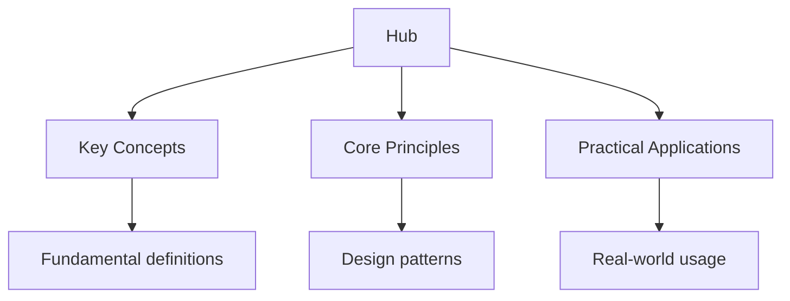

## Why This Guide Exists

TypeScript adds a static type system to JavaScript. It catches bugs at compile time, enables better tooling, and makes large codebases maintainable. TypeScript's type system is structural — types are compatible based on their shape, not their name. This makes TypeScript flexible while still providing safety. TypeScript is the dominant language for frontend development with React, Angular, and Vue, and is increasingly used for backend development with Node.js and Deno.

This hub page maps every resource on this site. The learning path takes you from TypeScript's core type system through generics, utility types, and React patterns, building a thorough understanding of how to write type-safe, maintainable JavaScript code.

## Table of Contents

- [Type System Basics](#type-system-basics)
- [Interfaces and Type Aliases](#interfaces-and-type-aliases)
- [Generics](#generics)
- [Utility Types](#utility-types)
- [Advanced Type Patterns](#advanced-type-patterns)
- [React with TypeScript](#react-with-typescript)
- [Learning Path](#learning-path)
- [Cross-Site Resources](#cross-site-resources)
- [FAQ](#faq)

---

## Type System Basics

TypeScript's type system is the foundation of everything else. Understanding primitive types, literal types, union types, and type narrowing is essential for writing type-safe code.

### Topic Notes

- [Primitive Types](02-type-system/01-primitive-types) — string, number, boolean, null, undefined, symbol, and bigint
- [Literal Types](02-type-system/02-literal-types) — string literals, number literals, and template literal types
- [Union and Intersection](02-type-system/03-union-and-intersection) — combining types with | and &
- [Type Narrowing](02-type-system/04-type-narrowing) — typeof, instanceof, in, and discriminated unions
- [Type Assertions](02-type-system/05-type-assertions) — as, satisfies, and non-null assertion !

### Key Concepts

**Literal types** — TypeScript can narrow a type to a specific value. A string literal type like `Direction` defined as a union of `"up" | "down" | "left" | "right"` enables precise type constraints and catches invalid values at compile time.

**Discriminated unions** — A union of types that share a common discriminant field. A `Result` type with a `status` discriminant allows TypeScript to narrow the type based on the discriminant value, enabling exhaustive pattern matching.

**Type narrowing** — The compiler narrows types based on control flow. `typeof x === "string"` narrows x to string inside the if block. The `in` operator narrows objects to include specific properties. Discriminated unions narrow based on tag values.

---

## Interfaces and Type Aliases

Interfaces and type aliases define the shape of objects. Interfaces are extensible and support declaration merging. Type aliases are more flexible and can represent unions, intersections, and mapped types.

### Topic Notes

- [Interfaces](03-interfaces/01-interfaces) — defining object shapes, optional properties, and readonly properties
- [Type Aliases](03-interfaces/02-type-aliases) — type keyword, unions, and intersections
- [Declaration Merging](03-interfaces/03-declaration-merging) — extending interfaces and module augmentation
- [Index Signatures](03-interfaces/04-index-signatures) — dynamic property access and Record types

### Key Concepts

**Interfaces vs type aliases** — Interfaces support declaration merging (you can add properties across multiple declarations) and are easier to extend. Type aliases can represent unions, intersections, and more complex types. Use interfaces for object shapes and type aliases for unions and computed types.

**Optional and readonly** — `name?: string` makes a property optional. `readonly id: number` makes a property immutable. Optional properties are common in configuration objects and API responses.

**Index signatures** — `{ [key: string]: number }` defines an object with string keys and number values. `Record<string, number>` is the utility type equivalent. Index signatures are useful for dictionaries and dynamic data.

---

## Generics

Generics enable you to write code that works with any type while preserving type information. They are the foundation of reusable, type-safe libraries and data structures.

### Topic Notes

- [Generic Functions](04-generics/01-generic-functions) — type parameters and type inference
- [Generic Constraints](04-generics/02-generic-constraints) — extends keyword and keyof
- [Generic Classes and Interfaces](04-generics/03-generic-classes-and-interfaces) — parameterized types and generic collections
- [Default Type Parameters](04-generics/04-default-type-parameters) — providing default types for generics

### Key Concepts

**Type parameters** — `function identity<T>(arg: T): T { return arg }` works for any type. The compiler infers the type from the argument. You can also specify the type explicitly: `identity<string>("hello")`.

**Generic constraints** — `function getProperty<T, K extends keyof T>(obj: T, key: K): T[K]` constrains K to be a key of T. This provides type-safe property access while maintaining generality.

**Utility type generics** — Most utility types are generic: `Partial<T>`, `Required<T>`, `Pick<T, K>`, `Omit<T, K>`. Understanding how generics work is essential for using these types effectively.

---

## Utility Types

TypeScript provides built-in utility types that transform and manipulate types. These types are essential for working with APIs, databases, and complex data structures.

### Topic Notes

- [Object Utility Types](05-utility/01-object-utility-types) — Partial, Required, Readonly, Pick, Omit, and Record
- [Union Utility Types](05-utility/02-union-utility-types) — Exclude, Extract, NonNullable, and ReturnType
- [Template Literal Types](05-utility/03-template-literal-types) — string manipulation at the type level
- [Conditional Types](05-utility/04-conditional-types) — ternary operator for types and infer keyword

### Key Concepts

**Partial and Required** — `Partial<T>` makes all properties optional. `Required<T>` makes all properties required. These are essential for update operations where you only provide some fields.

**Pick and Omit** — `Pick<T, "name" | "age">` extracts specific properties. `Omit<T, "password">` removes specific properties. These are essential for API request/response types.

**Conditional types** — `T extends U ? X : Y` evaluates to X if T extends U, otherwise Y. Combined with `infer`, conditional types enable powerful type transformations: extracting return types, unwrapping promise types, and flattening union types.

---

## Advanced Type Patterns

These patterns enable sophisticated type-level programming. They are essential for writing type-safe libraries and complex applications.

### Topic Notes

- [Mapped Types](06-advanced/01-mapped-types) — iterating over object properties and transforming types
- [Template Literal Manipulation](06-advanced/02-template-literal-manipulation) — Uppercase, Lowercase, and string transformations
- [Type Inference with infer](06-advanced/03-type-inference) — extracting types from complex structures
- [Branded Types](06-advanced/04-branded-types) — nominal typing in a structural type system

### Key Concepts

**Mapped types** — `{ [K in keyof T]: NewType }` iterates over the keys of T and transforms each property. This is how Partial, Required, and Readonly are implemented. Mapped types enable type-level iteration.

**Template literal types** — TypeScript can manipulate strings at the type level. `type EventName =`${"click" | "hover"}_${"start" | "end"}`` produces a union of four string literal types. Template literal types enable type-safe event systems and API routes.

**Branded types** — TypeScript's structural type system treats all objects with the same shape as compatible. Branded types add a phantom property to distinguish types: `type UserId = string & { readonly __brand: unique symbol }`. This prevents mixing UserId with other strings.

---

## React with TypeScript

TypeScript and React are a powerful combination. TypeScript provides type safety for props, state, hooks, and event handlers. React's component model pairs naturally with TypeScript's interface system.

### Topic Notes

- [Component Props](07-react/01-component-props) — typing props, default props, and children
- [Hooks](07-react/02-hooks) — useState, useEffect, useRef, and custom hooks
- [Event Handlers](07-react/03-event-handlers) — typing click, change, and form events
- [Context and Providers](07-react/04-context-and-providers) — typing React context and providers
- [Advanced Patterns](07-react/05-advanced-patterns) — generics, compound components, and render props

### Key Concepts

**Typing props** — Define an interface for component props: `interface ButtonProps { label: string; onClick: () => void; variant?: "primary" | "secondary" }`. Optional props use `?`. Destructure props in the component signature for clarity.

**Typing hooks** — `useState<string>("")` types the state. `useState<number | null>(null)` types a nullable state. `useRef<HTMLInputElement>(null)` types the ref. Custom hooks return typed values.

**Event handlers** — `React.ChangeEvent<HTMLInputElement>` types input change events. `React.MouseEvent<HTMLButtonElement>` types button clicks. `React.FormEvent<HTMLFormElement>` types form submissions.

---

## Learning Path

TypeScript builds on JavaScript knowledge. Follow this progression to build type-safe code.

### Stage 1: Type System (Weeks 1–3)

- Learn primitive types, literal types, and unions
- Understand interfaces and type aliases
- Study type narrowing and control flow analysis

### Stage 2: Generics and Utility Types (Weeks 4–6)

- Master generics and generic constraints
- Learn the built-in utility types — Partial, Pick, Omit, Record
- Study conditional types and mapped types

### Stage 3: React with TypeScript (Weeks 7–10)

- Type component props and state
- Learn typed hooks and event handlers
- Study context, providers, and advanced patterns

### Stage 4: Advanced Patterns (Weeks 11–14)

- Study branded types and nominal typing
- Learn template literal types and string manipulation
- Build a type-safe library or application

---

## Cross-Site Resources

Wyatt's Notes is a network of interconnected programming and study sites:

- **[JavaScript Reference](https://programming.wyattau.com/hub)** — TypeScript is a superset of JavaScript, understanding JS is essential
- **[Python Programming Guide](https://python.wyattau.com/hub)** — if you are comparing TypeScript with a dynamic language
- **[Dart/Flutter Programming Guide](https://dart.wyattau.com/hub)** — Dart has a similar typed approach for mobile development
- **[Computer Science Study Guide](https://computer-science.wyattau.com/hub)** — algorithms and data structures that apply to TypeScript
- **[Database Design Guide](https://databases.wyattau.com/hub)** — relevant for TypeScript database access with Prisma and Drizzle

---

## Frequently Asked Questions

### Should I learn JavaScript or TypeScript first?

Learn JavaScript first. TypeScript is a superset of JavaScript — everything you learn in JavaScript applies to TypeScript. Understanding JavaScript's quirks, runtime behavior, and ecosystem makes TypeScript easier to learn and more meaningful.

### Is TypeScript just for frontend development?

No. TypeScript is used for frontend (React, Angular, Vue), backend (Node.js, Deno, Bun), full-stack (Next.js, Remix), mobile (React Native), and desktop (Electron) development. TypeScript is a general-purpose language that compiles to JavaScript.

### What is the difference between interface and type alias?

Interfaces support declaration merging and are easier to extend with extends. Type aliases can represent unions, intersections, and more complex types. Use interfaces for object shapes that may be extended. Use type aliases for unions, intersections, and computed types.

### Do I need to use TypeScript for React?

It is strongly recommended. TypeScript catches prop errors at compile time, provides better autocompletion, and makes refactoring safer. The React ecosystem has excellent TypeScript support. Most new React projects use TypeScript.

### What are utility types and when should I use them?

Utility types are built-in types that transform other types. Partial makes properties optional. Pick extracts specific properties. Omit removes properties. Record creates object types. Use them to derive types from existing interfaces instead of duplicating definitions.

### How do I type API responses?

Define interfaces for your API responses: `interface ApiResponse<T> { data: T; status: number; message: string }`. Use generics to make the response type parameterized. Libraries like Zod can validate and type API responses at runtime.

---

*Last updated: 24 July 2026*

*Written by Wyatt. For questions or feedback, visit [wyattau.com](https://wyattau.com).*
